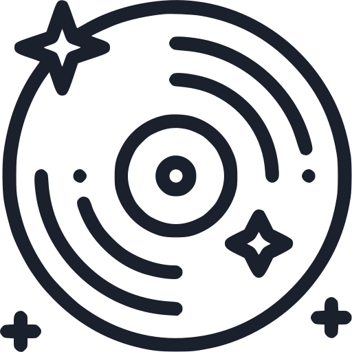

<!-- PROJECT SHIELDS -->
[![Contributors][contributors-shield]][contributors-url]
[![Forks][forks-shield]][forks-url]
[![Stargazers][stars-shield]][stars-url]
[![Issues][issues-shield]][issues-url]
[![MIT License][license-shield]][license-url]
[![LinkedIn][linkedin-shield]][linkedin-url]

<!-- PROJECT LOGO -->
 

  

<h3 align="center">SongBoard</h3>

  

    An app that generates a playlist of songs based on the 'vibes' of your Pinterest boards
     
    <a href="https://github.com/ChinoUkaegbu/SongBoard"><strong>Explore the docs »</strong></a>
     
     
    <a href="https://songboard-front-end.vercel.app">View Demo</a>
    ·
    <a href="https://github.com/ChinoUkaegbu/SongBoard/issues/new?labels=bug&template=bug-report---.md">Report Bug</a>
    ·
    <a href="https://github.com/ChinoUkaegbu/SongBoard/issues/new?labels=enhancement&template=feature-request---.md">Request Feature</a>
  

<!-- TABLE OF CONTENTS -->

  
Table of Contents

  <ol>
    <li>
      <a href="#about-the-project">About The Project</a>
      <ul>
        <li><a href="#built-with">Built With</a></li>
      </ul>
    </li>
    <li><a href="#getting-started">Getting Started</a></li>
    <li><a href="#usage">Usage</a></li>
      <ul>
        <li><a href="#pinterest-users">Pinterest Users</a></li>
        <li><a href="#non-pinterest-users">Non-Pinterest Users</a></li>
      </ul>
    <li><a href="#how-it-works">How it Works</a></li>
    <li><a href="#roadmap">Roadmap</a></li>
    <li><a href="#contributing">Contributing</a></li>
    <li><a href="#license">License</a></li>
    <li><a href="#contact">Contact</a></li>
    <li><a href="#acknowledgments">Acknowledgments</a></li>
  </ol>

<!-- ABOUT THE PROJECT -->
## About The Project

[![SongBoard Screen Shot][product-screenshot]](https://songboard-front-end.vercel.app)

🎵✨ We love to soundtrack our lives...or at least I do. A morning jog by the park with your favorite tunes keeping the rhythm of every step you take. An afternoon cafe run - slow jazz songs in the background amidst the clack of laptop keys. An evening beach trip with friends, synth-filled melodies flowing through the speakers. It feels like you can find a playlist for anything you can type into a search engine - but what if you don't have the words for it?

With SongBoard, you can generate a playlist based on 'vibes' - specifically the vibes of your curated Pinterest boards. Each Pinterest board is a unique reflection of your interests, themes, and aesthetic choice _literally_ hand picked by you. Why not have a playlist that does the same?🎵✨ 

(<a href="#readme-top">back to top</a>)

### Built With

* [![React][React.js]][React-url]
* [![Node][Node.js]][Node-url]
* [![Express][Express.js]][Express-url]
* [![Chakra UI][Chakra.com]][Chakra-url]
* [![Vercel][Vercel.com]][Vercel-url]

(<a href="#readme-top">back to top</a>)

<!-- GETTING STARTED -->
## Getting Started

You can access the web application <a href="https://songboard-front-end.vercel.app/">here</a>. This repository manages the front end and the back end can be found <a href="https://github.com/ChinoUkaegbu/songboard-back-end">here</a>.

(<a href="#readme-top">back to top</a>)

<!-- USAGE EXAMPLES -->
## Usage
### Pinterest Users
If you have a Pinterest account with boards, simply click on the Get Started button on the homepage. 
* **Connect & Sync:** Link your Pinterest account to SongBoard effortlessly.
* **Discover & Inspire:** Choose any board filled with your favorite pins and let our app analyze the images.
* **Play & Enjoy:** Receive a curated playlist that matches the mood, theme, and vibe of your board.
  
_The songs are embedded from Spotify's API meaning you can save the songs to your account as well!_  
 

### Non-Pinterest Users
Still want to try out SongBoard but don't have a Pinterest account? Navigate to the <a href="https://songboard-front-end.vercel.app/demo">Demo</a> page of the website and type in the URLs of the images you want to base your playlist off of.
#### Note
* The URLs must be separated by spaces e.g. `https://image1.jpg https://image2.jpg`.
* The URLs must point to valid images hosted on the web.

(<a href="#readme-top">back to top</a>)

<!-- TECHNICAL-ISH EXPLANATION -->
## How it Works

(<a href="#readme-top">back to top</a>)

<!-- ROADMAP -->
## Roadmap

- [ ] Save playlists to Spotify
- [ ] Implement dark mode

See the [open issues](https://github.com/ChinoUkaegbu/SongBoard/issues) for a full list of proposed features (and known issues).

(<a href="#readme-top">back to top</a>)

<!-- CONTRIBUTING -->
## Contributing

Contributions are what make the open source community such an amazing place to learn, inspire, and create. Any contributions you make are **greatly appreciated**.

If you have a suggestion that would make this better, please fork the repo and create a pull request. You can also simply open an issue with the tag "enhancement".
Don't forget to give the project a star! Thanks again!

1. Fork the Project
2. Create your Feature Branch (`git checkout -b feature/AmazingFeature`)
3. Commit your Changes (`git commit -m 'Add some AmazingFeature'`)
4. Push to the Branch (`git push origin feature/AmazingFeature`)
5. Open a Pull Request

(<a href="#readme-top">back to top</a>)

<!-- LICENSE -->
## License

Distributed under the MIT License. See `LICENSE.txt` for more information.

(<a href="#readme-top">back to top</a>)

<!-- CONTACT -->
## Contact

Chino Ukaegbu - [@twitter_handle](https://twitter.com/twitter_handle) - chinoukaegbu@gmail.com

Project Link: [https://github.com/ChinoUkaegbu/SongBoard](https://github.com/ChinoUkaegbu/SongBoard)

(<a href="#readme-top">back to top</a>)

<!-- ACKNOWLEDGMENTS -->
## Acknowledgments

* [Chidinma Ukaegbu](https://www.behance.net/chidinma-designer) - for being the first app tester (and the best sister ever)
* My Twitter oomfs - for letting me yap whenever I ran into an error

(<a href="#readme-top">back to top</a>)

<!-- MARKDOWN LINKS & IMAGES -->
<!-- https://www.markdownguide.org/basic-syntax/#reference-style-links -->
[contributors-shield]: https://img.shields.io/github/contributors/ChinoUkaegbu/SongBoard.svg?style=for-the-badge
[contributors-url]: https://github.com/ChinoUkaegbu/SongBoard/graphs/contributors
[forks-shield]: https://img.shields.io/github/forks/ChinoUkaegbu/SongBoard.svg?style=for-the-badge
[forks-url]: https://github.com/ChinoUkaegbu/SongBoard/network/members
[stars-shield]: https://img.shields.io/github/stars/ChinoUkaegbu/SongBoard.svg?style=for-the-badge
[stars-url]: https://github.com/ChinoUkaegbu/SongBoard/stargazers
[issues-shield]: https://img.shields.io/github/issues/ChinoUkaegbu/SongBoard.svg?style=for-the-badge
[issues-url]: https://github.com/ChinoUkaegbu/SongBoard/issues
[license-shield]: https://img.shields.io/github/license/ChinoUkaegbu/SongBoard.svg?style=for-the-badge
[license-url]: https://github.com/ChinoUkaegbu/SongBoard/blob/master/LICENSE.txt
[linkedin-shield]: https://img.shields.io/badge/-LinkedIn-black.svg?style=for-the-badge&logo=linkedin&colorB=555
[linkedin-url]: https://www.linkedin.com/in/chinonyerem-ukaegbu
[product-screenshot]: assets_readme/home_page_1.png
[React.js]: https://img.shields.io/badge/React-20232A?style=for-the-badge&logo=react&logoColor=61DAFB
[React-url]: https://reactjs.org/
[Node.js]: https://img.shields.io/badge/Node%20js-339933?style=for-the-badge&logo=nodedotjs&logoColor=white
[Node-url]: https://nodejs.org/en
[Express.js]: https://img.shields.io/badge/Express%20js-000000?style=for-the-badge&logo=express&logoColor=white
[Express-url]: https://expressjs.com/
[Chakra.com]: https://img.shields.io/badge/Chakra--UI-319795?style=for-the-badge&logo=chakra-ui&logoColor=white
[Chakra-url]: https://v2.chakra-ui.com/
[Vercel.com]: https://img.shields.io/badge/Vercel-000000?style=for-the-badge&logo=vercel&logoColor=white
[Vercel-url]: https://vercel.com/
